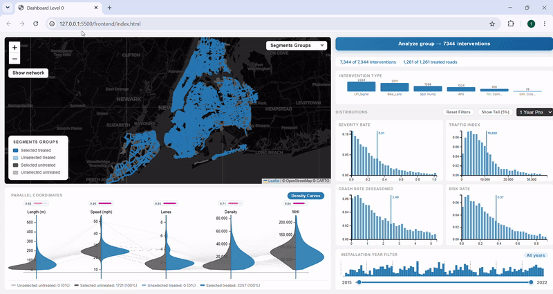
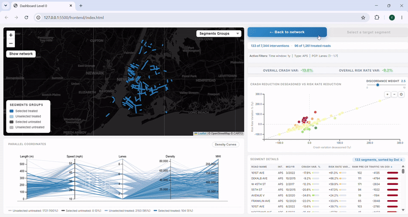

# Visual Analytics for Urban Policy Evaluation: NYC Vision Zero

**Master's Thesis Project**  
**Data Science Master's Degree (Honor Program)**  
**Sapienza University of Rome**  
**Author:** Federico Trionfetti

---

## 📖 Abstract

Urban road safety interventions represent significant public investments, yet their evaluation remains methodologically underdeveloped. Cities that adopt **Vision Zero** deploy physical measures across their street networks with limited ability to verify whether those measures reach the populations most in need, whether they genuinely reduce crash risk rather than simply reflecting changes in traffic volume, or whether they displace that risk onto neighbouring streets.

This repository hosts a full-stack, interactive visual analytics dashboard designed to make this gap analytically tractable, taking **New York City's Vision Zero programme** as its empirical setting. By combining a Python/Flask backend with a dynamic DC.js/Mapbox frontend, the tool enables a multi-level spatial and temporal analysis of road safety measures.

---

## 📺 Dashboard Demonstration

---

## 🔬 Research Context & Addressed Limitations

This project overcomes several critical limitations (gaps) identified in existing road safety evaluation literature:

1. **The Exposure Problem:** A reduction in crashes may simply reflect a reduction in traffic. This dashboard evaluates safety using the **Risk Rate**—seasonally adjusted crashes normalized by Annual Average Daily Traffic (AADT) at the segment level.
2. **The Heterogeneity Problem:** Interventions are not all equal. The analysis strictly disaggregates multiple types of Traffic Calming Measures (TCMs), treating a speed hump and a pedestrian signal as distinct analytical categories.
3. **The Aggregation Problem (MAUP):** Aggregating outcomes to census tracts dissolves vital within-zone variations. The analysis is anchored to the granular individual road segment (RCSTA) rather than aggregated zones.
4. **The Spillover Problem:** Does traffic calming eliminate risk or just displace it? The system measures spatial spillover to adjacent, untreated segments within an adjustable spatial radius.
5. **The Equity Problem:** Does safety investment favour high-income areas? The dashboard integrates socio-economic variables (ACS 2019 Median Household Income) at the segment level to evaluate intervention allocation equity.

---

## ⚙️ Progressive System Architecture

The interface is structured into a three-level progressive-disclosure architecture, guiding the user from macro-allocation to micro-effectiveness without losing context.

### Level 0: Network Scale (Allocation)
**Goal:** Understand decision drivers behind intervention installations and socio-demographic patterns across the full street network.
- **Crossfilters & Interactive Map:** Filter thousands of treated and untreated arterial segments by installation year, intervention type, or pre-intervention severity and income quartiles.
- **Deduplicated Parallel Coordinates Plot (PCP):** Explores stable road-level metrics (e.g., length, density, income, speed limits). The PCP automatically deduplicates segments to avoid artificial overlaps, outputting an **Active Cohort**.

### Level 1: Cohort Scale (Effectiveness)
**Goal:** Assess the performance of the selected cohort and identify outliers.
- **Crash Reduction vs AADT Reduction:** A vital tool to verify true safety improvements. A massive drop in crashes is only considered a success if it outpaces the drop in traffic volume.
- **Segment Details:** Locate the most relevant cohort members, passing a single **Target Segment** to the local scale analysis.

### Level 2: Local Scale (Spillover)
**Goal:** Evaluate local spillover effects for a single, isolated intervention.
- **Target vs Local Segments:** Isolates the treated segment and utilizes a dynamic radius slider (up to 1,500m) to fetch spatial neighbours.
- **Month-by-Month Risk Trajectory:** Traces the risk rate across the full 2015–2022 panel to reveal whether the change was abrupt, gradual, or merely a continuation of a pre-existing trend.
- **Risk Displacement Map:** Compares pre- and post-intervention risk rates on the map along a continuous colour scale from risk reduction (green) to risk increase (red), highlighting potential risk displacement.

---

## 📊 Data Sources & ETL Pipeline

The empirical foundation relies on a multi-stage ETL pipeline integrating six heterogeneous data sources into a unified geospatial panel (2015–2022):
- **Traffic Collisions:** NYC Open Data Motor Vehicle Collisions (~1.7M matched records).
- **Traffic Volume (Exposure):** NYSDOT Highway Data Services AADT Panel.
- **Road Geometry:** NYSDOT TDV GeoDatabase (RCSTA segments).
- **Vision Zero Interventions:** 7 distinct VZV open datasets (~18.5k matched records).
- **Socio-Economic Context:** U.S. Census ACS 2019 (Median Household Income).

---

## 🛠️ Technology Stack

- **Backend:** Python, Flask, Pandas, PyArrow (Parquet for fast panel data querying and aggregation), GeoPandas.
- **Frontend:** HTML5, CSS3, JavaScript, DC.js, D3.js, Crossfilter, Leaflet.js / Mapbox.
- **Data Engineering:** Extract-Transform-Load (ETL) spatial pipeline with 50m tolerance for incident snapping and 1,500m spatial weight matrix for spillover analysis.

---

## 👨‍💻 Author

**Federico Trionfetti**  
*Data Science Master's Degree (Honor Program)*  
*Sapienza University of Rome*
